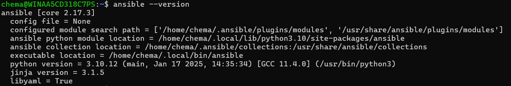

# Ansible4Windows


- [Initial Set-Up](#initial-set-up)
  - [WinRM](#winrm)
  - [SSH](#ssh-for-windows-server-2025)
  - [Configure ubuntu](#configure-ubuntu-and-prepare-the-environment)
- [Create inventory file](#create-a-new-inventory)
- [Test connection](#test-connection)
- [Configure key pair](#configure-key-pair)

<div align="center">
<h1> Introduction</h1>
</div>

A collection of playbooks for the daily management of windows devices, user creation, software installation and feature management for windows. Here I will store all the playbooks that can be useful for windows.

# Initial Set-Up
There are mainly two ways to use ansible for windows, WinRM and SSH, depending on which one you want to use we will have to perform the following steps on all hosts

## WinRM
Run the following commands in powershell to enable control of the computer through WinRM

```shell
# Powershell as administrator
winrm quickconfig
winrm set winrm/config/service/Auth '@{Basic="true"}'
winrm set winrm/config/service '@{AllowUnencrypted="true"}'

```
Enable WinRM (HTTP - Port 5985)
```shell
New-NetFirewallRule -DisplayName "Allow WinRM HTTP" -Direction Inbound -LocalPort 5985 -Protocol TCP -Action Allow -Profile Any
```

Enable WinRM (HTTPS - Port 5986)
```shell
New-NetFirewallRule -DisplayName "Allow WinRM HTTPS" -Direction Inbound -LocalPort 5986 -Protocol TCP -Action Allow -Profile Any
```


## SSH for Windows Server 2025
To enable ssh on a windows server you need an active ssh server on the machine, windows server 2025 includes as an option the possibility to install OpenSSH, to do this we will use the following steps

Add the service
```shell
set-service -name sshd -StartupType Automatic
```
Create firewall rule
```shell
New-NetFirewallRule -DisplayName 'Permitir SSH' -Name 'Permitir SSH' -Profile Any -LocalPort 22 -Protocol TCP
```
Configure the defatult shell for SSH
```shell
New-ItemProperty -Path "HKLM:\SOFTWARE\OpenSSH" -Name ShellPorDefecto -Value "C:\Windows\System32\WindowsPowerShell\v1.0\powershell.exe" -PropertyType String -Force
```
Start the service
```shell
start-service -name sshd
```

## Configure key pair
Generate an SSH key pair on your Ubuntu machine
```shell
ssh-keygen -b 4096
```
This creates two files in ~/.ssh/

id_ed25519 (private key)
id_ed25519.pub (publick key)

### Transfer public key to server
Create the file "C:\ProgramData\ssh\administrators_authorized_keys and paste the content of the generated public key
```shell
cat ~/.ssh/id_ed25519.pub
```
Expected result
You should be able to access the windows machine by SSH without password
```shell
ssh ansible_user@192.168.10.165
```

# Configure ubuntu and prepare the environment

Upgrade ubuntu 24.04
```shell
sudo apt update && sudo apt dist-upgrade -y
```
Install the necessary packages
```shell
sudo apt install -y software-properties-common
```
Add the official ansible repository and install it
```shell
sudo add-apt-repository --yes --update ppa:ansible/ansible
sudo apt install ansible vim iputils-ping sshpass -y
```
Check de ansible version
```shell
ansible --version
```
Expected answer



# Create a new inventory

Create a new file called inventory.ini
```shell
sudo nano ./inventory.ini
```

File content
```shell
[windows]
server2025 ansible_host=192.168.10.165 #Listado de servidores
[all:vars]
ansible_connection = ssh
ansible_shell_type = powershell
ansible_ssh_common_args='-o StrictHostKeyChecking=no'
```
# Test connection

```shell
ansible all -i inventory.ini -m ansible.windows.win_ping -u Administrator --ask-pass
```